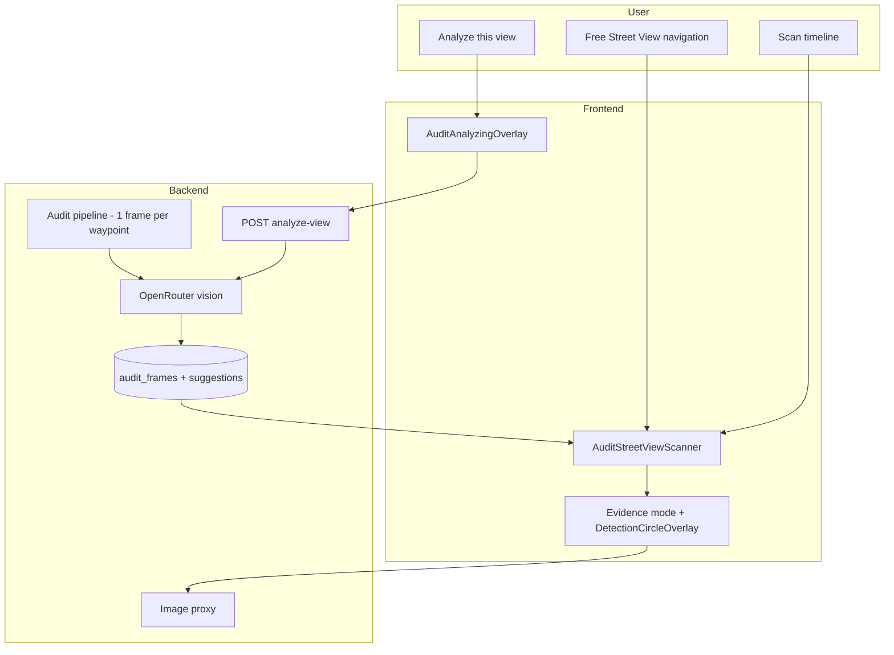

# Interactive Street Audit Scanner with AI Severity Overlays — Blueprint

> **Status:** Phase 7 complete — Street View scanner blueprint fully delivered  
> **Scope:** Backend pipeline, API, and frontend audit experience  
> **Constraint:** Do not start Phase N+1 until Phase N checklist is signed off

---

## 1. Goal

Replace the current **discrete static-frame audit** (same GPS point × 4 headings, filmstrip browser, separate panorama) with an **integrated Street View scanner** that feels like part of the map experience:

- Reviewers **move freely** through Street View (pan, look around, click links) — like Google Maps Street View.
- AI **analysis stays in the product**, with a clear **loading state** while the model runs.
- Where the AI finds defects, the UI draws **severity circles** on the view:
  - **Red** — high (and critical)
  - **Yellow** — medium
  - **Green** — low
- Scanning follows the **route corridor**, not four redundant snapshots of the same spot.

### Success criteria

| # | Criterion |
|---|-----------|
| 1 | One scan sample per waypoint along the route (not 4 headings at the same coordinates) |
| 2 | Audit run detail opens a **full-screen or primary-panel Street View scanner**, not a frame grid as the main experience |
| 3 | User can navigate the panorama without leaving the audit context |
| 4 | Analyzed locations show severity circles; clean locations show no overlay |
| 5 | While AI is running (pipeline or on-demand), a dedicated **analyzing loading screen** is visible |
| 6 | Suggestion review still works: accept/reject/convert with evidence tied to the analyzed view |

### Non-goals (v1)

- Pixel-perfect object detection (vision LLM coordinates remain approximate)
- Real-time continuous video analysis while the user drags the view
- Replacing Google Street View with custom 3D tiles
- Backfilling overlays onto audit runs created under the old 4-heading pipeline

---

## 2. Problem with the current approach

### Today’s pipeline

```
Route waypoints
  → for each waypoint: 4 static frames (headings 0°, 90°, 180°, 270°)
  → OpenRouter vision model per JPEG
  → persist audit_frames + audit_suggestions
  → UI: filmstrip / static AnalyzedFrameViewer + separate StreetViewPanel
```

Key file: `backend/app/services/audit_service.py` — `HEADINGS = (0, 90, 180, 270)` and `_build_frames()`.

### Why this feels wrong

| Issue | Impact |
|-------|--------|
| **4 frames at one GPS point** | Wastes API calls; duplicates work; confuses reviewers (“why four views of the same corner?”) |
| **Static JPEG is primary evidence** | Correct for AI input, but disconnected from the exploratory Street View experience |
| **Frame browser is the main UI** | Feels like a photo gallery, not “walking the street” |
| **Panorama is secondary** | Geographic context is relegated below a static image |

### What we keep from prior work

Phases 2–7 of the earlier blueprint shipped useful building blocks. **Reuse, don’t throw away:**

| Asset | Reuse |
|-------|-------|
| `audit_frames` table + detection regions JSON | Store one analyzed view per scan point |
| `DetectionRegion` circle model | Same overlay math |
| `DetectionCircleOverlay.vue` | Render circles on analyzed imagery |
| Image proxy endpoints | Safe JPEG delivery without exposing API key |
| AI prompt with `regions[]` | Same schema; prompt may add POV context |

**Deprioritize (not delete immediately):** `AuditFrameBrowser.vue` filmstrip as the *primary* run experience — keep as optional “scan timeline” secondary panel.

---

## 3. Target experience

### 3.1 Audit run detail — primary layout

```
┌──────────────────────────────────────────────────────────────┐
│  Audit run header · progress · suggestion count                │
├──────────────────────────────────────────────────────────────┤
│                                                              │
│   ┌────────────────────────────────────────────────────┐    │
│   │  INTERACTIVE STREET VIEW (full width, ~60vh)        │    │
│   │  · free pan / look / click-to-move along street     │    │
│   │  · severity circles on analyzed views               │    │
│   │  · scan path polyline on mini-map (optional)        │    │
│   └────────────────────────────────────────────────────┘    │
│                                                              │
│   [ Analyze this view ]   ← on-demand, shows loading overlay │
│                                                              │
│   Scan timeline (compact) · suggestion list (sidebar)       │
└──────────────────────────────────────────────────────────────┘
```

### 3.2 Navigation model

| Action | Behavior |
|--------|----------|
| Open run | Jump to **first scan point** (or first detection) in Street View |
| Click arrow / link in panorama | Move freely along the street (standard Google behavior) |
| Select scan point on timeline | `setPano()` + `setPov()` to that stored POV |
| Select suggestion card | Same POV as the detection + circles visible |
| “Analyze this view” | Capture current POV → backend AI → loading screen → circles appear |

### 3.3 Analyzing loading screen

Shown when:

- Backend pipeline is processing the run (bulk scan), **or**
- User triggers on-demand analysis of the current view

**UX requirements:**

- Full overlay on the scanner panel (not a tiny spinner in the corner)
- Copy: e.g. “Analyzing street view…” + run name / coordinates
- Progress when bulk scanning: “Scan point 8 of 16” (from `frames_done` / `frames_total`)
- Non-blocking close/cancel only for on-demand analyze (pipeline progress stays visible on run page)
- Respects `prefers-reduced-motion` (static progress bar, no pulsing street imagery)

### 3.4 Severity circles on the view

| Severity | Color | Default radius (normalized) | Label |
|----------|-------|-----------------------------|-------|
| low | `#22c55e` (green) | 0.06 | Low |
| medium | `#eab308` (yellow) | 0.09 | Medium |
| high | `#ef4444` (red) | 0.12 | High |
| critical | `#b91c1c` (dark red) | 0.14 | Critical |

- Circles are labeled **“AI-estimated location”** in UI copy and tooltips.
- Clamp model-provided `radius` to `[0.04, 0.18]`.
- Hover/tap: category, confidence, description snippet.
- Missing regions: show analyzed view without circles + badge “Location not pinpointed”.

### 3.5 Overlay rendering strategy (approved direction for v1)

Google’s live `StreetViewPanorama` does not accept normalized 2D SVG overlays natively. Use a **hybrid scanner**:

1. **Explore mode** — live panorama; user moves freely; scan points shown as map/timeline markers.
2. **Evidence mode** — when paused on an analyzed scan point (or after on-demand analyze completes), show the **proxied static JPEG** (exact AI input) with `DetectionCircleOverlay` aligned on top, visually composited over or beside the panorama so it feels like one surface.

Transition: brief crossfade from live pano → evidence snapshot at the same POV. User can click **“Explore again”** to return to live navigation.

This preserves overlay accuracy without inventing fragile 3D projection from LLM coordinates.

---

## 4. Scanning model (backend)

### 4.1 One view per waypoint

Replace 4-heading fan with **one camera pose per waypoint**:

```
Route corridor waypoints (existing expand_point_to_corridor)
  → compute heading = direction of travel toward next waypoint
  → single Static Street View fetch per waypoint
  → AI analyze → persist audit_frame (+ suggestion if issue)
```

| Field | Source |
|-------|--------|
| `latitude`, `longitude` | Waypoint |
| `heading` | Bearing to next point (last point: bearing from previous) |
| `pitch` | **`0°`** (locked in Phase 1) |
| `frame_index` | Monotonic along route |

**Expected frame count:** ~16 for Bill Clinton Boulevard instead of ~64.

### 4.2 Optional on-demand analyze endpoint

For views the user navigates to that were not pre-scanned:

| Method | Path | Purpose |
|--------|------|---------|
| `POST` | `/api/v1/audit-runs/{run_id}/analyze-view` | Body: `{ latitude, longitude, heading, pitch }` → fetch static image → AI → upsert frame record → return analysis |

Rate-limit and debounce on frontend. Reuse confidence threshold and suggestion creation rules from pipeline.

### 4.3 Data model changes (minimal)

`audit_frames` already fits. Add optional columns if needed in Phase 2:

| Column | Purpose |
|--------|---------|
| `scan_source` | `pipeline` \| `on_demand` |
| `pano_id` | Google panorama ID at capture time (helps re-link if coords drift) |

Suggestions keep `detection_regions`, `frame_index`, geo + POV fields.

### 4.4 API surface (v2)

| Method | Path | Purpose |
|--------|------|---------|
| `GET` | `/api/v1/audit-runs/{run_id}/scan-path` | Ordered list of scan points `{ frame_index, lat, lng, heading, pitch, has_detection, severity? }` for timeline + map |
| `GET` | `/api/v1/audit-runs/{run_id}/frames/{frame_index}` | Unchanged — full frame + regions |
| `GET` | `/api/v1/audit-runs/{run_id}/frames/{frame_index}/image` | Unchanged — proxied JPEG |
| `POST` | `/api/v1/audit-runs/{run_id}/analyze-view` | New — on-demand analysis |
| `GET` | `/api/v1/audit-suggestions/{suggestion_id}` | Unchanged — includes regions + frame_index |

---

## 5. Implementation phases

Follow phases in order. **Do not start Phase N+1 until Phase N checklist is signed off.**

---

### Phase 1 — Requirements lock ✅

**Outcome:** Decisions documented; no code.  
**Approved:** 2026-05-22 (stakeholder request: start Phase 1).

#### Locked decisions

| # | Decision | Approved choice | Rationale |
|---|----------|-----------------|-----------|
| 1 | Headings per waypoint | **1 — direction of travel** | Eliminates 4 redundant frames at the same GPS point; scan feels like walking the route |
| 2 | Primary audit UI | **`AuditStreetViewScanner` on run detail** | Street View is the main surface; not a filmstrip gallery |
| 3 | Overlay technique | **Hybrid explore + evidence** | Live pano for navigation; proxied static JPEG + SVG circles for accurate AI evidence |
| 4 | On-demand analyze | **In scope for v1** | “Analyze this view” button with full-panel loading overlay |
| 5 | Bulk pipeline loading | **Full-panel overlay on scanner** | Progress text: “Scan point N of M” while `status === 'running'` |
| 6 | Frame browser | **Secondary — compact timeline tab** | `AuditFrameBrowser` kept as “All frames” fallback tab, not primary |
| 7 | Legacy runs | **No backfill** | Runs with 4× waypoint frame counts show legacy banner + filmstrip fallback |
| 8 | Pitch default | **`0°`** | No downward road tilt in v1; simplifies POV sync between pano and static API |
| 9 | Initial POV on open | **First detection, else first scan point** | Reviewers land on actionable evidence when available |
| 10 | Mini-map | **Deferred to Phase 6** | Optional polyline; timeline is sufficient for v1 |
| 11 | On-demand rate limit | **10 requests / run / hour** | Backend setting; frontend disables button while in flight |
| 12 | Evidence mode trigger | **Auto on detection select; manual toggle for clean points** | Selecting a suggestion or flagged scan point enters evidence mode |
| 13 | Lightbox entry | **Remove `AuditRunStreetViewLightbox` in Phase 3** | Single scanner entry on run detail; no duplicate modal |
| 14 | Region shape | **`DetectionRegion` circle** (unchanged) | Reuse existing stack; clamp radius `[0.04, 0.18]` |
| 15 | Image delivery | **Backend proxy only** | Never expose Google API key in frontend URLs |

#### Approved severity visual mapping

| Severity | Color | Circle radius (normalized) | UI label |
|----------|-------|----------------------------|----------|
| low | `#22c55e` (green) | 0.06 | Low |
| medium | `#eab308` (yellow) | 0.09 | Medium |
| high | `#ef4444` (red) | 0.12 | High |
| critical | `#b91c1c` (dark red) | 0.14 | Critical |

Copy rule: all overlays and tooltips include **“AI-estimated location”**. Missing regions → badge **“Location not pinpointed”** (frame still shown).

#### Scanner mode state machine

```
                    ┌─────────────┐
         open run   │   EXPLORE   │◄──────────────────┐
        ──────────► │  live pano  │                   │
                    └──────┬──────┘                   │
                           │ select detection /        │ "Explore again"
                           │ flagged scan point        │
                           ▼                           │
                    ┌─────────────┐                   │
                    │  EVIDENCE   │───────────────────┘
                    │ static JPEG │
                    │ + circles   │
                    └──────┬──────┘
                           │ "Analyze this view"
                           ▼
                    ┌─────────────┐
                    │  ANALYZING  │─── success ──► EVIDENCE (if issue) or EXPLORE (clean)
                    │   overlay   │
                    └──────┬──────┘
                           │ error
                           └──► EXPLORE + toast
```

Pipeline bulk scan: **EXPLORE** (or placeholder) with **ANALYZING** overlay until `status !== 'running'`.

#### Wireframes

**Desktop — run detail (explore mode)**

```
┌────────────────────────────────────────────────────────────────────────────┐
│ ← Audit runs    Bill Clinton Boulevard          [Running ●]  3 issues      │
│ Scanned May 22, 2026 · Prizren · Scan 8/16                                 │
├───────────────────────────────────────────────┬────────────────────────────┤
│                                               │  AI suggestions (3)        │
│  ┌─────────────────────────────────────────┐  │  ┌──────────────────────┐  │
│  │                                         │  │  │ ● Pothole · High     │  │
│  │     [ Google Street View — live ]       │  │  │   Frame 5 · 91%      │  │
│  │     user pans / clicks arrows freely    │  │  └──────────────────────┘  │
│  │                                         │  │  ┌──────────────────────┐  │
│  │                                         │  │  │ ● Garbage · Medium   │  │
│  └─────────────────────────────────────────┘  │  └──────────────────────┘  │
│  [ Analyze this view ]  [ Explore | Evidence ]│  …                          │
│                                               │  [ Accept ] [ Reject ]       │
│  Scan timeline:  ○ ○ ○ ● ○ ◉ ○ ○ ○ ○ ○ ○ ○ ○ ○  │                            │
│                  1 2 3 4 5 6 … 16              │                            │
│                  ◉ = selected   ● = detection  │                            │
├───────────────────────────────────────────────┴────────────────────────────┤
│  [ Scanner ]  [ All frames ]  ← tabs; "All frames" = legacy filmstrip      │
└────────────────────────────────────────────────────────────────────────────┘
```

**Desktop — evidence mode (detection selected)**

```
┌────────────────────────────────────────────────────────────────────────────┐
│  Scanner — Evidence · Frame 5 of 16          [ Explore again ]             │
├───────────────────────────────────────────────┬────────────────────────────┤
│  ┌─────────────────────────────────────────┐  │  Pothole · High · 91%      │
│  │  [ proxied static JPEG — exact AI input ]│  │  "Large pothole in lane"   │
│  │         ╭─── red circle ───╮             │  │                            │
│  │         │   AI-estimated   │             │  │  42.6601, 21.1554          │
│  │         ╰──────────────────╯             │  │  Heading 142°              │
│  └─────────────────────────────────────────┘  │  [ Accept ] [ Reject ]     │
│  Legend: ● Low  ● Medium  ● High  ● Critical │                            │
└───────────────────────────────────────────────┴────────────────────────────┘
```

**Analyzing overlay (pipeline or on-demand)**

```
┌────────────────────────────────────────────────────────────────────────────┐
│  ┌─────────────────────────────────────────────────────────────────────┐   │
│  │ ░░░░░░░░░░░░░░░░░░░░░░░░░░░░░░░░░░░░░░░░░░░░░░░░░░░░░░░░░░░░░░░░░░ │   │
│  │ ░░░░░░░░░░░░░░░░░░░░░░░░░░░░░░░░░░░░░░░░░░░░░░░░░░░░░░░░░░░░░░░░░░ │   │
│  │ ░░░░░░░░░░░░░░░░  ◌  Analyzing street view… ░░░░░░░░░░░░░░░░░░░░░░░ │   │
│  │ ░░░░░░░░░░░░░░░░  Bill Clinton Boulevard ░░░░░░░░░░░░░░░░░░░░░░░░░ │   │
│  │ ░░░░░░░░░░░░░░░░  Scan point 8 of 16 ░░░░░░░░░░░░░░░░░░░░░░░░░░░░░ │   │
│  │ ░░░░░░░░░░░░░░░░  ████████░░░░░░░░░░ 50% ░░░░░░░░░░░░░░░░░░░░░░░░░ │   │
│  │ ░░░░░░░░░░░░░░░░░░░░░░░░░░░░░░░░░░░░░░░░░░░░░░░░░░░░░░░░░░░░░░░░░░ │   │
│  │ ░░░░░░░░░░░░░░░░░░░░░░░░░░░░░░░░░░░░░░░░░░░░░░░░░░░░░░░░░░░░░░░░░░ │   │
│  └─────────────────────────────────────────────────────────────────────┘   │
│  On-demand only: [ Cancel ]  (disabled during pipeline bulk scan)          │
└────────────────────────────────────────────────────────────────────────────┘
```

**Mobile (≤640px) — stacked layout**

```
┌─────────────────────────┐
│ Bill Clinton Blvd  ● Run│
│ Scan 8/16 · 3 issues    │
├─────────────────────────┤
│                         │
│   [ Street View 50vh ]  │
│                         │
├─────────────────────────┤
│ [Analyze] [Evidence ▼]  │
│ ○○○●◉○○○… timeline      │
├─────────────────────────┤
│ Suggestions (sheet)     │
│ ┌─────────────────────┐ │
│ │ Pothole · High      │ │
│ └─────────────────────┘ │
└─────────────────────────┘
```

#### UI copy (locked)

| Context | Copy |
|---------|------|
| Scanner eyebrow | `Street audit scanner` |
| Explore mode badge | `Explore` |
| Evidence mode badge | `Evidence` |
| Analyze button | `Analyze this view` |
| Return from evidence | `Explore again` |
| Pipeline overlay title | `Analyzing street view…` |
| On-demand overlay title | `Analyzing this view…` |
| Progress | `Scan point {done} of {total}` |
| Overlay disclaimer | `AI-estimated location` |
| Missing regions | `Location not pinpointed` |
| Legacy banner | `Legacy scan format (4 views per point). Use All frames tab for full gallery.` |

#### Legacy run detection rule

A run is **legacy** when:

```
frames_total > 0 AND frames_total % 4 === 0 AND frames_total >= 16
AND (frames_total / unique_waypoint_estimate) >= 3.5
```

Practical v1 heuristic: if `frames_total >= 32` and run was created before migration deploy date, treat as legacy. Phase 6 implements exact detection using waypoint count from scan-path once Phase 2 ships.

#### Phase 1 checklist

- [x] Stakeholder confirms single-heading scan model
- [x] Hybrid overlay approach accepted
- [x] On-demand analyze in scope for v1
- [x] Severity color table approved
- [x] Wireframes approved (scanner layout + loading state + evidence mode + mobile)

#### Phase 1 completion gate for Phase 2

Phase 2 may begin when all of the above are checked. **All items checked — proceed to Phase 2.**

---

### Phase 2 — Backend scan pipeline refactor ✅

**Outcome:** New runs use one frame per waypoint; scan path API available.  
**Completed:** 2026-05-22.

#### Shipped

| Item | Detail |
|------|--------|
| Route geometry | `backend/app/utils/route_geometry.py` — `heading_along_route()`, `build_scan_frames()` |
| Pipeline | Removed 4-heading fan-out; one frame per waypoint facing direction of travel |
| Migration | `0004_audit_frame_scan_source.py` — `audit_frames.scan_source` (`pipeline` \| `on_demand`) |
| API | `GET /api/v1/audit-runs/{run_id}/scan-path` → `AuditScanPoint[]` |
| Demo seed | `_build_demo_route_frames()` uses single-heading model (~16 frames for Bill Clinton) |
| Tests | `backend/tests/test_audit_scan_path.py` — 16 tests passing |

#### Phase 2 checklist

- [x] `_build_frames()` produces N frames for N waypoints
- [x] `frames_total` on new runs matches waypoint count
- [x] `GET /scan-path` returns ordered scan points
- [x] Existing frame/image/suggestion endpoints still work
- [x] Tests pass

---

### Phase 3 — Street View scanner shell (frontend) ✅

**Outcome:** Run detail centers on a navigable Street View panel tied to the audit run.  
**Completed:** 2026-05-22.

#### Shipped

| Item | Detail |
|------|--------|
| `AuditStreetViewScanner.vue` | Primary scanner — wraps `StreetViewPanel`, scan progress label, timeline |
| `AuditScanTimeline.vue` | Horizontal scan-point strip; severity-colored markers |
| `AuditRunDetailPanel.vue` | Scanner + suggestions sidebar; **Scanner / All frames** tabs |
| API client | `listAuditScanPath()` in `frontend/src/api/auditFrames.ts` |
| Types | `AuditScanPoint`, `AuditScanSource` in `frontend/src/types/audit.ts` |
| Pages | `AuditPage.vue`, `AuditRunDetailPage.vue` load scan path |
| Removed | `AuditRunStreetViewLightbox.vue` — queue “view street” selects run + scrolls to scanner |

#### Phase 3 checklist

- [x] Run detail opens scanner as primary content
- [x] User can pan and click-to-move in panorama
- [x] Timeline click jumps to correct scan point POV
- [x] Suggestion selection syncs scanner position
- [x] No regression on dashboard `StreetViewPanel`

---

### Phase 4 — Analyzing loading experience ✅

**Outcome:** Clear loading UI during pipeline and on-demand analysis.  
**Completed:** 2026-05-22.

#### Shipped

| Item | Detail |
|------|--------|
| `AuditAnalyzingOverlay.vue` | Full-panel overlay — spinner, title, subtitle, progress bar, cancel (on-demand only) |
| Pipeline overlay | Shown while run `status` is `queued` or `running`; progress from `frames_done / frames_total` |
| On-demand analyze | **Analyze this view** button + overlay; `POST /api/v1/audit-runs/{id}/analyze-view` |
| Rate limit | `KOSTREET_AUDIT_ON_DEMAND_MAX_PER_RUN_PER_HOUR` (default 10) |
| `StreetViewPanel` | Optional `trackViewChanges` + `getCurrentView()` expose (dashboard unchanged) |
| Polling | Run detail page refreshes run + scan path every 8s while pipeline active |
| Reduced motion | Overlay uses static spinner + no animation when `prefers-reduced-motion` |

#### Phase 4 checklist

- [x] Pipeline progress visible on scanner during run
- [x] On-demand analyze shows loading overlay
- [x] Errors surfaced without breaking panorama
- [x] Reduced-motion variant verified

---

### Phase 5 — Severity circle overlays in scanner ✅

**Outcome:** Detections visible as colored circles when viewing analyzed scan points.  
**Completed:** 2026-05-22.

#### Shipped

| Item | Detail |
|------|--------|
| Evidence mode | `AuditStreetViewScanner` crossfades to proxied static JPEG + `DetectionCircleOverlay` |
| Explore ↔ Evidence | Auto-enter on detection/suggestion; **Explore again** / **View evidence** toggles |
| `AuditSeverityLegend.vue` | Low (green), medium (yellow), high (red), critical (dark red) |
| Missing regions | **Location not pinpointed** badge + **AI-estimated location** disclaimer |
| Keyboard | Arrow keys move timeline selection; Enter toggles evidence/explore |
| Suggestion detail | Legend + `is-civic-issue` on `AnalyzedFrameViewer`; Street View as secondary context |
| `AnalyzedFrameViewer` | New `scanner` layout + `isCivicIssue` prop |

#### Phase 5 checklist

- [x] High → red, medium → yellow, low → green circles render correctly
- [x] Critical uses dark red, larger radius
- [x] Missing regions show badge, no crash
- [x] Evidence ↔ explore toggle works
- [x] Suggestion detail shows same overlay treatment

---

### Phase 6 — Demo data, legacy fallback, polish ✅

**Outcome:** Pitch Mode and demos reflect new scanner; old runs degrade gracefully.  
**Completed:** 2026-05-22.

#### Shipped

| Item | Detail |
|------|--------|
| Demo scan path | `frontend/src/demo/demoAuditScanPath.ts` — 16 scan points, 3 detections with regions |
| Demo runs | `demoAuditRuns.ts` updated; legacy demo run (`frames_total: 64`) for banner testing |
| Demo wiring | `AuditPage.vue` loads demo scan path + frames; scanner works without API |
| Legacy fallback | `frontend/src/utils/auditLegacy.ts` + banner in `AuditRunDetailPanel.vue` |
| Demo script | `docs/demo-script.md` updated for scanner + evidence + legacy flow |
| Tests | `frontend/src/utils/auditLegacy.test.ts` |

#### Phase 6 checklist

- [x] Demo mode shows scanner + overlays without live API
- [x] Legacy run fallback documented and working
- [x] Backend + frontend tests updated
- [x] Demo script (`docs/demo-script.md`) updated for new flow

---

### Phase 7 — Review workflow integration & launch ✅

**Outcome:** Accept/reject/convert flows work entirely within scanner context.  
**Completed:** 2026-05-22.

#### Shipped

| Item | Detail |
|------|--------|
| On-demand → suggestions | Optimistic scan path/frame upsert + fetch new suggestion after analyze |
| Timeline status markers | Enriched scan path shows accepted/rejected/converted states on timeline dots |
| Sidebar review | Compact suggestion cards in scanner workspace (review/convert without navigation) |
| Prefetch | Neighbor evidence JPEGs prefetched on timeline hover/focus |
| Quota UX | `GET /on-demand-quota` + remaining-count label; 429 handling on analyze |
| Tests | `auditScanPath.test.ts`, `test_audit_phase7.py` |

#### Phase 7 checklist

- [x] Review actions work from run detail without navigating away
- [x] Convert-to-report preserves geo + frame reference
- [x] Prefetch does not jank panorama
- [x] Feature ready for municipal demo

---

## 6. Architecture diagram



---

## 7. Shared types (unchanged)

```ts
interface DetectionRegion {
  center_x: number; // 0–1
  center_y: number; // 0–1
  radius: number;   // 0–1 relative to min(image width, height)
}

interface AuditScanPoint {
  frame_index: number;
  latitude: number;
  longitude: number;
  heading: number;
  pitch: number;
  is_civic_issue: boolean;
  severity?: 'low' | 'medium' | 'high' | 'critical' | null;
  suggestion_id?: string | null;
}
```

AI response shape (per analyzed view):

```json
{
  "is_civic_issue": true,
  "category": "pothole",
  "confidence": 0.91,
  "severity": "high",
  "description": "Large pothole in the travel lane.",
  "regions": [{ "center_x": 0.42, "center_y": 0.68, "radius": 0.12 }]
}
```

---

## 8. Risks and mitigations

| Risk | Mitigation |
|------|------------|
| LLM coordinates imprecise | Circles + “AI-estimated location” copy; evidence mode uses exact JPEG analyzed |
| Live pano ≠ static snapshot | Hybrid model; never draw circles on live pano without evidence snapshot |
| On-demand analyze cost | Rate limits; debounce; optional feature flag |
| Heading along route wrong on sharp curves | Use bearing between consecutive waypoints; tune corridor density |
| Legacy 4-heading runs confuse users | Detect legacy frame counts; show fallback UI + banner |
| Google API key exposure | Keep backend image proxy only |

---

## 9. Migration from current implementation

| Current | After this blueprint |
|---------|----------------------|
| 4 headings × N waypoints | N waypoints × 1 heading |
| `AuditFrameBrowser` filmstrip primary | `AuditStreetViewScanner` primary |
| `AnalyzedFrameViewer` on suggestion detail | Evidence mode inside scanner |
| `AuditRunStreetViewLightbox` separate | Merged into run detail scanner |
| Phase 7 “complete” overlay blueprint | Superseded by this document for UX direction |

**Reuse without rewrite:** `DetectionCircleOverlay`, `audit_frames`, region validation in `ai_service.py`, image proxy routes.

---

## 10. Phase summary

| Phase | Focus | Deliverable |
|-------|--------|-------------|
| **1** ✅ | Requirements lock | Approved decisions + wireframes |
| **2** ✅ | Backend pipeline | Single-heading scan + scan-path API |
| **3** ✅ | Scanner shell | Free Street View navigation on run detail |
| **4** ✅ | Loading UX | Pipeline + on-demand analyzing overlays |
| **5** ✅ | Severity circles | Evidence mode with red/yellow/green overlays |
| **6** ✅ | Demo & legacy | Seeds, fallback, tests, demo script |
| **7** ✅ | Review integration | End-to-end municipal workflow |

---

## 11. Completion

All seven phases of the Street View scanner blueprint are complete. The audit run detail workspace supports free navigation, evidence overlays, on-demand analyze with quota guardrails, sidebar review/convert, and demo/legacy fallbacks.
